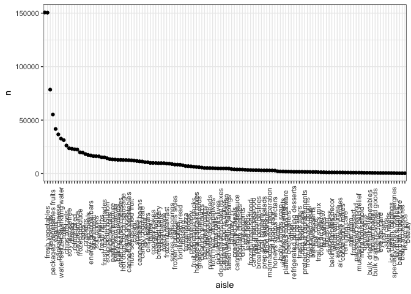
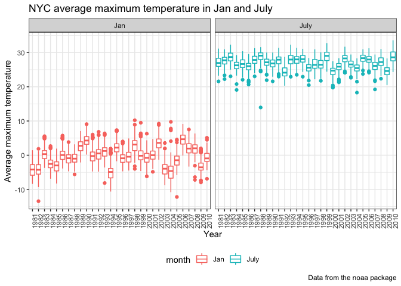
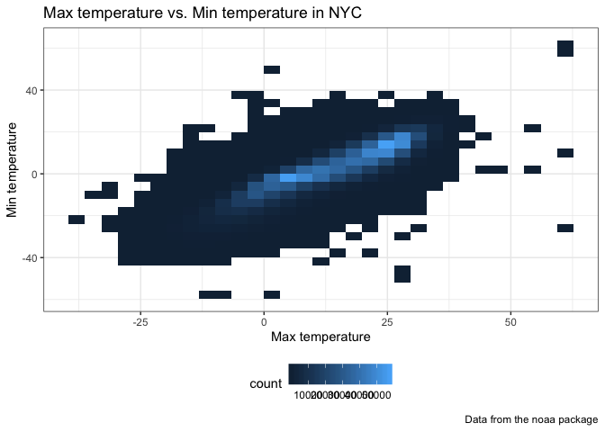
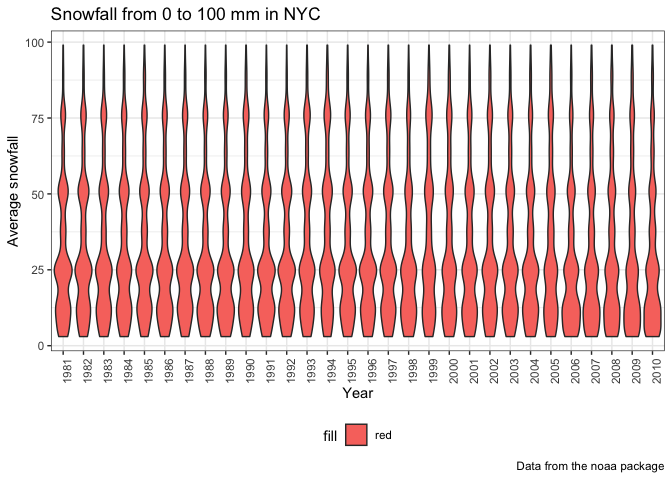

p8105\_hw3\_xs2330
================
Xiao Shi
October 14, 2018

Probelm 1
---------

**Data cleaning**

``` r
brfss = brfss_smart2010 %>%
  janitor::clean_names() %>%
  filter(topic == "Overall Health") %>%
  mutate(response = as.factor(response))
```

**States with 7 locations**

``` r
brfss_2002 = filter(brfss, year == 2002) %>%
  select(locationabbr, locationdesc) %>%
  distinct() %>%
  count(locationabbr)
states_7locs = brfss_2002[which(brfss_2002$n == 7), 1]
states_7locs
```

    ## # A tibble: 3 x 1
    ##   locationabbr
    ##   <chr>       
    ## 1 CT          
    ## 2 FL          
    ## 3 NC

The above three states have 7 observations

**Spaghetti plot of locations**

``` r
brfss_obser = select(brfss, year, locationabbr, locationdesc) %>%
  group_by(year) %>%
  count(locationabbr)
ggplot(brfss_obser, aes(x = year, y = n, color = locationabbr)) +
  geom_line() +
  labs(
    title = "Number of Observations in each state from 2002 to 2010",
    x = "Year",
    y = "Number of Observations",
    caption = "Data from the p8105 package"
  ) +
  viridis::scale_colour_viridis(
    name = "locationabbr", 
    discrete = TRUE
  ) +
  theme_set(theme_bw() + theme(legend.position = "right"))
```


**2002, 2006, 2010 mean table for "Excellent" responses**

``` r
prop_table_mean = filter(brfss, year == 2002 | year == 2006 | year == 2010) %>%
  filter(locationabbr == "NY") %>%
  filter(response == "Excellent") %>%
  select(year, locationdesc, response, data_value) %>%
  group_by(year) %>%
  summarize(mean_excellent = mean(data_value)) %>% 
  spread(key = year, value = mean_excellent) %>% 
  knitr::kable(digits = 1)
```

**2002, 2006, 2010 sd table for "Excellent" responses**

``` r
prop_table_sd = filter(brfss, year == 2002 | year == 2006 | year == 2010) %>%
  filter(locationabbr == "NY") %>%
  filter(response == "Excellent") %>%
  select(year, locationdesc, response, data_value) %>%
  group_by(year) %>%
  summarize(sd_excellent = sd(data_value)) %>% 
  spread(key = year, value = sd_excellent) %>% 
  knitr::kable(digits = 1)
```

**Five-panel plot for each response category over time**

``` r
five_panel = select(brfss, year, locationabbr, locationdesc, response, data_value) %>%
  group_by(year, locationabbr, response) %>%
  summarize(respon_mean = mean(data_value))
ggplot(five_panel, aes(x = year, y = respon_mean, color = response)) +
  geom_point() +
  labs(
    title = "Number of Observations in each state from 2002 to 2010",
    x = "Year",
    y = "Number of Observations",
    caption = "Data from the p8105 package"
  ) +
  facet_grid(~response) +
  viridis::scale_colour_viridis(
    name = "response", 
    discrete = TRUE
  ) +
  theme_set(theme_bw() + theme(legend.position = "bottom")) +
  theme(axis.text.x = element_text(angle = 90))
```

 The above 5-panel plot shows the average proportion in each response category, and the distribution of these state-level averages over time.

Problem 2
---------

``` r
inscart = instacart
summary(inscart)
```

    ##     order_id         product_id    add_to_cart_order   reordered     
    ##  Min.   :      1   Min.   :    1   Min.   : 1.000    Min.   :0.0000  
    ##  1st Qu.: 843370   1st Qu.:13380   1st Qu.: 3.000    1st Qu.:0.0000  
    ##  Median :1701880   Median :25298   Median : 7.000    Median :1.0000  
    ##  Mean   :1706298   Mean   :25556   Mean   : 8.758    Mean   :0.5986  
    ##  3rd Qu.:2568023   3rd Qu.:37940   3rd Qu.:12.000    3rd Qu.:1.0000  
    ##  Max.   :3421070   Max.   :49688   Max.   :80.000    Max.   :1.0000  
    ##     user_id         eval_set          order_number      order_dow    
    ##  Min.   :     1   Length:1384617     Min.   :  4.00   Min.   :0.000  
    ##  1st Qu.: 51732   Class :character   1st Qu.:  6.00   1st Qu.:1.000  
    ##  Median :102933   Mode  :character   Median : 11.00   Median :3.000  
    ##  Mean   :103113                      Mean   : 17.09   Mean   :2.701  
    ##  3rd Qu.:154959                      3rd Qu.: 21.00   3rd Qu.:5.000  
    ##  Max.   :206209                      Max.   :100.00   Max.   :6.000  
    ##  order_hour_of_day days_since_prior_order product_name      
    ##  Min.   : 0.00     Min.   : 0.00          Length:1384617    
    ##  1st Qu.:10.00     1st Qu.: 7.00          Class :character  
    ##  Median :14.00     Median :15.00          Mode  :character  
    ##  Mean   :13.58     Mean   :17.07                            
    ##  3rd Qu.:17.00     3rd Qu.:30.00                            
    ##  Max.   :23.00     Max.   :30.00                            
    ##     aisle_id     department_id      aisle            department       
    ##  Min.   :  1.0   Min.   : 1.00   Length:1384617     Length:1384617    
    ##  1st Qu.: 31.0   1st Qu.: 4.00   Class :character   Class :character  
    ##  Median : 83.0   Median : 8.00   Mode  :character   Mode  :character  
    ##  Mean   : 71.3   Mean   : 9.84                                        
    ##  3rd Qu.:107.0   3rd Qu.:16.00                                        
    ##  Max.   :134.0   Max.   :21.00

The `instacart` dataset consist of 1384617 rows, and 15 columns. Each row in the dataset is a product from an order. The dataset provided detialed information from the customers' side such as user ID by `user_id`, and the hour of day on which the order was placed by `order_dow`. On the other side, the dataset also provided detialed information from the seller's side such as aisle ID by `aisle_id`, and the aisle name by `aisle`.

How many aisles are there, and which aisles are the most items ordered from? Make a plot that shows the number of items ordered in each aisle. Order aisles sensibly, and organize your plot so others can read it. Make a table showing the most popular item aisles “baking ingredients”, “dog food care”, and “packaged vegetables fruits” Make a table showing the mean hour of the day at which Pink Lady Apples and Coffee Ice Cream are ordered on each day of the week; format this table for human readers (i.e. produce a 2 x 7 table).

**Number of aisles**

``` r
num_aisle = nrow(distinct(inscart, aisle_id))
```

The number of aisle is 134

**items ordered in each aisle**

``` r
num_item_aisle = inscart %>%
  count(aisle) %>%
  mutate(aisle = fct_reorder(aisle, desc(n)))
ggplot(num_item_aisle, aes(x = aisle, y = n)) +
    geom_point() +
    theme(axis.text.x = element_text(angle = 90))
```



**Popular item aisles**

``` r
popular_aisles = filter(inscart, aisle == "baking ingredients" | aisle == "dog food care" | aisle == "packaged vegetables fruits") %>%
  group_by(aisle, product_name) %>%
  count(product_name)
popular_aisles_baking = filter(popular_aisles, aisle == "baking ingredients")
most_popular_baking = popular_aisles_baking[which.max(popular_aisles_baking$n),2]
popular_aisles_dog = filter(popular_aisles, aisle == "dog food care")
most_popular_dog = popular_aisles_dog[which.max(popular_aisles_dog$n),2]
popular_aisles_veggie = filter(popular_aisles, aisle == "packaged vegetables fruits")
most_popular_veggie = popular_aisles_veggie[which.max(popular_aisles_veggie$n),2]
popular_aisles = cbind.data.frame(most_popular_veggie, most_popular_dog, most_popular_baking)
colnames(popular_aisles) = c("packaged vegetables fruits", "dog food care", "baking ingredients")
knitr::kable(popular_aisles)
```

| packaged vegetables fruits | dog food care                                 | baking ingredients |
|:---------------------------|:----------------------------------------------|:-------------------|
| Organic Baby Spinach       | Snack Sticks Chicken & Rice Recipe Dog Treats | Light Brown Sugar  |

Above table shows the most popular item aisles in “baking ingredients”, “dog food care”, and “packaged vegetables fruits”

**Pink Lady Apples and Coffee Ice Cream orders by day**

``` r
mean_hour_apple_coffee = select(inscart, order_id, order_dow, order_hour_of_day, product_name) %>%
  mutate(order_dow = factor(order_dow, labels = c("Sun", "Mon", "Tue", "Wed", "Thu", "Fri", "Sat"))) %>%
  filter(product_name == "Pink Lady Apples" | product_name == "Coffee Ice Cream") %>%
  group_by(order_dow, product_name) %>%
  janitor::clean_names() %>%
  summarise(mean_order_hour = mean(order_hour_of_day)) %>%
  spread(key = order_dow, value = mean_order_hour)
knitr::kable(mean_hour_apple_coffee)  
```

| product\_name    |       Sun|       Mon|       Tue|       Wed|       Thu|       Fri|       Sat|
|:-----------------|---------:|---------:|---------:|---------:|---------:|---------:|---------:|
| Coffee Ice Cream |  13.77419|  14.31579|  15.38095|  15.31818|  15.21739|  12.26316|  13.83333|
| Pink Lady Apples |  13.44118|  11.36000|  11.70213|  14.25000|  11.55172|  12.78431|  11.93750|

Problem 3
---------

``` r
skimr::skim(ny_noaa)
```

    ## Skim summary statistics
    ##  n obs: 2595176 
    ##  n variables: 7 
    ## 
    ## ── Variable type:character ────────────────────────────────────────────────
    ##  variable missing complete       n min max empty n_unique
    ##        id       0  2595176 2595176  11  11     0      747
    ##      tmax 1134358  1460818 2595176   1   4     0      532
    ##      tmin 1134420  1460756 2595176   1   4     0      548
    ## 
    ## ── Variable type:Date ─────────────────────────────────────────────────────
    ##  variable missing complete       n        min        max     median
    ##      date       0  2595176 2595176 1981-01-01 2010-12-31 1997-01-21
    ##  n_unique
    ##     10957
    ## 
    ## ── Variable type:integer ──────────────────────────────────────────────────
    ##  variable missing complete       n  mean     sd  p0 p25 p50 p75  p100
    ##      prcp  145838  2449338 2595176 29.82  78.18   0   0   0  23 22860
    ##      snow  381221  2213955 2595176  4.99  27.22 -13   0   0   0 10160
    ##      snwd  591786  2003390 2595176 37.31 113.54   0   0   0   0  9195
    ##      hist
    ##  ▇▁▁▁▁▁▁▁
    ##  ▇▁▁▁▁▁▁▁
    ##  ▇▁▁▁▁▁▁▁

The ny noaa data were accessed from the NOAA National Climatic Data Center, consisting of 2595176 rows and 7. Key variables include date by `date`, prcipitation by `prcp`, snowfall by `snow`, depth of snow by `snwd`, highest temparture by `tmax`, and lowest temparture by `tmin`. For `tmax` and `tmin`, 0.4371025 of the data is missing, which is a big problem if we are trying to calculate temparature related results because we cannot be sure whether the missing data would lead to a different result.

**data cleaning**

``` r
ny_noaa_cleaned = separate(ny_noaa, date, into = c("year", "month", "day"), sep = "-") %>%
  mutate(tmax = as.integer(tmax)) %>%
  mutate(tmax = tmax/10) %>%
  mutate(tmin = as.integer(tmin)) %>%
  mutate(tmin = tmin/10) %>%
  mutate(prcp = prcp/10) 
getmode <- function(v) {
   uniqv <- unique(v)
   uniqv[which.max(tabulate(match(v, uniqv)))]
} 
snowmode = getmode(ny_noaa$snow)
```

The most commonly observed value for snowfall is 0, because it's not always winter in NYC

**NYC average maximum temperature in Jan and July**

``` r
tmax_jan_july = select(ny_noaa_cleaned, id, year, month, tmax, tmin) %>%
  filter(month == "01" | month == "07") %>%
  mutate(month = factor(month, labels = c("Jan", "July"))) %>%
  group_by(id, year, month) %>% 
  summarize(mean_tmax = mean(tmax, na.rm = TRUE),
            mean_tmin = mean(tmin, na.rm = TRUE))
ggplot(tmax_jan_july, aes(x = year, y = mean_tmax, color = month)) +
  geom_boxplot() +
  facet_grid(~month) +
  theme(axis.text.x = element_text(angle = 90)) +
  labs(
    title = "NYC average maximum temperature in Jan and July",
    x = "Year",
    y = "Average maximum temperature",
    caption = "Data from the noaa package"
  )
```



From the two-panel plot showing the average temperature in January and in July in each station across years. The average maximum temperature in both January and July fluctuates around a certain level through out 3 decades. Outliers in January are seen on the higher temperature side, and outliers in July are seen on the lower temperature side.

**Max temperature vs. Min temperature in NYC**

two panel plot to show tmax vs tmin for the full dataset

``` r
ggplot(ny_noaa_cleaned, aes(x = tmax, y = tmin)) +
  geom_bin2d() +
  labs(
    title = "Max temperature vs. Min temperature in NYC",
    x = "Max temperature",
    y = "Min temperature",
    caption = "Data from the noaa package"
  )
```



A heat map was chosen because we are trying to display a lot of matched pairs of data (max temp vs. min temp).

**Snowfall greater than 0 and less than 100 separately by year**

``` r
snow_fall = select(ny_noaa_cleaned, id, month, year, snow) %>%
  filter(snow > 0 & snow < 100)
ggplot(snow_fall, aes(x = year, y = snow, fill = "red")) +
  geom_violin() +
  labs(
    title = "Snowfall from 0 to 100 mm in NYC",
    x = "Year",
    y = "Average snowfall",
    caption = "Data from the noaa package"
  ) +
  theme(axis.text.x = element_text(angle = 90))
```



A violin graph was chosen because the snowfall is a variable without much change throughout the years. Thus the violin graph is able to show the fact that snowfalls are stable through out the years, but also able to show the tiny difference between years. For example, the year 2010 has a different shape around 37 mm.
